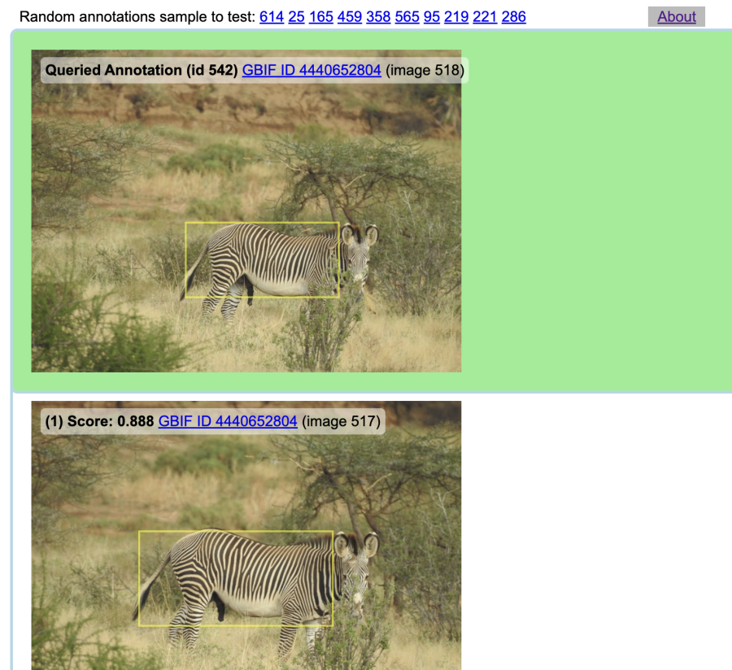

# GBIF Wildlife Re-ID Vector Embedding

## Concept

Query GBIF api for occurrences which contain image data. Process images to detect sub-sections of image containing wildlife ("annotations").
Extract from each annotation identifying information as vector embeddings, using [ml-service](https://github.com/WildMeOrg/ml-service).
Store data in sql tables using [pgvector](https://github.com/pgvector/pgvector), which allows for searching similarity between vectors across all
annotations.

## Usage

Bring up the pgvector docker container and webapp (demo) with `docker compose up`. At this point in the prototyping phase, the initialization of
the **ml-service** container is _not yet automated in this process_, so its setup is currently beyond the scope of this document.

### Tools provided

- `grab.sh` - simple tool to acquire sample data from GBIF
- `data_to_db.pl` - use GBIF data to initialize db, e.g. `grab.sh | data_to_db.pl`
- `mk_ann.pl` - finds unprocessed images and extracts annotations/embeddings _[requires ml-service]_

### Demo

A minimal demo will run on its own docker container using the pgvector database. It is available at
`http://localhost:8300/` and serves as a very simple way to visualize a query annotation (top panel)
matched against the best scoring embedding results (panels below), ranked from highest match score to lowest.

Users can scroll up and down through the top 10 results.
A good rule of thumb is any score above ~0.6 has a high likelihood of representing the same individual animal.



### Example of populated annotation table

```
gbif_embeddings=# select id, bbox, image_id, substring(embedding::text, 0, 100) from annotation order by random() limit 10;
 id  |                 bbox                  | image_id |                                              substring                                              
-----+---------------------------------------+----------+-----------------------------------------------------------------------------------------------------
 332 | {}                                    |      373 | 
 217 | {"bbox":[303,314,767,674],"theta":0}  |      130 | [-0.55916286,-1.2121346,-0.5209574,-0.29899216,-0.028761,-1.2490895,1.2357941,-0.3969796,-1.2256595
 222 | {"bbox":[469,131,968,949],"theta":0}  |      132 | [2.6983793,1.1236569,-1.4533582,0.79096615,-1.5922022,0.05778006,0.32227492,-1.3044813,2.3275108,0.
 429 | {"bbox":[461,397,1174,945],"theta":0} |      436 | [-0.43734482,-0.43093732,1.2779753,-0.061320372,-0.5789037,0.41547436,0.8350813,-1.7893411,-0.60005
 691 | {"bbox":[1,104,1450,1257],"theta":0}  |      624 | [0.51003873,0.4955722,-0.8598165,-0.5661119,0.15357421,0.6232465,-0.96255887,-0.6701776,-0.9976782,
 555 | {"theta":0,"bbox":[347,559,608,366]}  |      526 | [-0.29867724,-0.9241973,-0.69931084,2.3104725,3.2035863,-0.34834066,0.17939667,-0.7760905,0.0147604
 164 | {"theta":0,"bbox":[671,412,687,482]}  |       95 | [-0.17424859,-0.65056217,-1.4378531,-0.35486785,1.2016565,-0.7206802,-1.0571436,0.40861925,-0.81863
  53 | {"theta":0,"bbox":[819,209,603,1063]} |       20 | [-0.76395625,0.9930372,-1.040732,-0.10531827,4.1541867,-1.5018767,1.1158069,-1.5203233,-0.31317466,
 211 | {"bbox":[1337,401,560,302],"theta":0} |      126 | [1.1181855,-0.5022637,-0.375741,0.20512669,2.0423033,-0.055156067,2.1398652,-1.1762737,0.37133294,0
 246 | {"theta":0,"bbox":[369,430,1032,751]} |      148 | [0.05893112,-0.29343748,-0.47064632,-0.19019204,-0.71218526,-0.46293324,-0.89545864,-0.2944421,-0.5
(10 rows)
```

